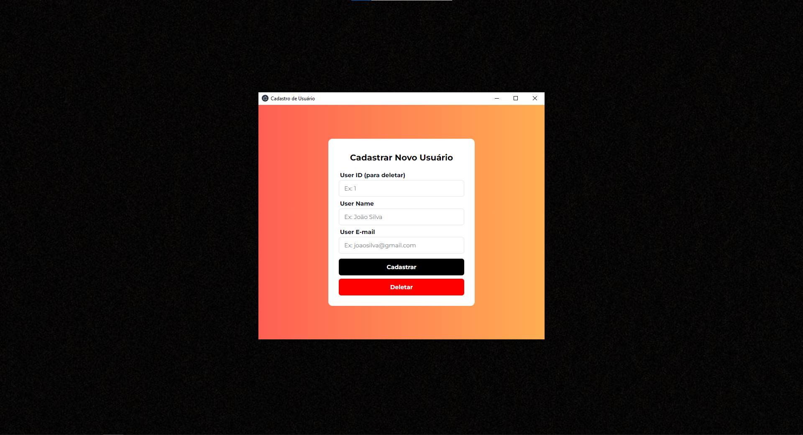

# ApiBasic-FrontEnd
# FrontEnd - Gerenciamento de Usuários

Este projeto é um frontend criado para gerenciar usuários, permitindo a inserção e exclusão com base em seus IDs. Ele foi desenvolvido para interagir com um backend, acessível no repositório api-basic (https://github.com/ud0uglas/api-basic) , que fornece a API para operações básicas de gerenciamento de usuários.

## Tecnologias Utilizadas

- **Electron**: Framework para criar aplicações desktop com tecnologias web.
- **shadcn/ui**: Biblioteca de componentes de interface de usuário.
- **React**: Biblioteca JavaScript para a construção de interfaces de usuário.
- **TypeScript**: Superset de JavaScript que adiciona tipos estáticos.
- **Tailwind CSS**: Framework de CSS utilitário para estilização rápida e eficiente.

## Funcionalidades

- **Inserir Usuário**: Adiciona novos usuários ao sistema com um ID fornecido.
- **Deletar Usuário**: Remove usuários existentes com base no ID.

---

